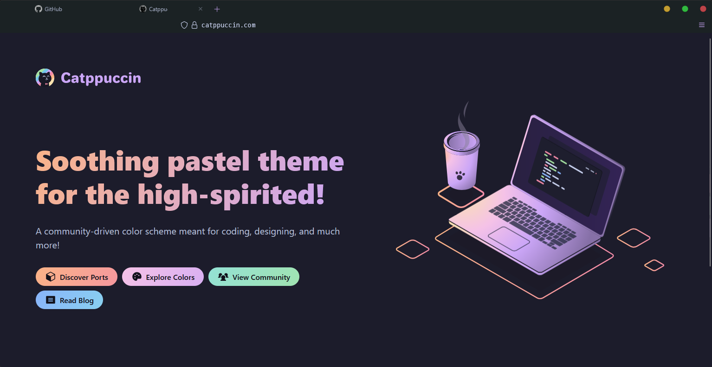

# Firefox Minimal Theme


A clean, minimalist Firefox theme that transforms your browser into a distraction-free, transparent interface. This `userChrome.css` configuration creates a seamless browsing experience with reduced visual clutter and a modern aesthetic.



## ✨ Features

### **Clean Interface**
- **Square Tabs**: Removes rounded corners for a modern, geometric look
- **Transparent Toolbars**: All toolbars blend seamlessly with your desktop
- **Hidden Window Controls**: Min/Max/Close buttons are removed for maximum screen real estate
- **Minimal Navigation**: Back/forward buttons are completely hidden
- **Smart Address Bar Icons**: URL bar icons are hidden by default and appear on hover

### **Tab Enhancements**
- **Responsive Tab Titles**: Tab titles are intelligently truncated using character-based sizing (5 characters by default, 3 on mobile)
- **Monochrome Favicons**: All favicons are displayed in grayscale by default
- **Color on Hover**: Favicons return to full color when you hover over tabs
- **Unified Tab Colors**: Active and inactive tabs share the same transparent background

### **Typography**
- **JetBrains Mono**: Custom monospace font for URL bar, menus, and tabs with modern fallback chain
- **Cross-Platform Fonts**: Enhanced font stack including `ui-monospace`, `SF Mono`, `Consolas` for better compatibility
- **Consistent Styling**: Unified font treatment across all interface elements
- **Clean Readability**: Optimized for developer-friendly aesthetic

### **Interactive Elements**
- **Smart Tab Close Buttons**: Fade in on hover, stay visible on active tabs
- **Hover-Reveal Icons**: Address bar icons appear smoothly when needed
- **Smooth Transitions**: Consistent `0.25s ease-out` animations for professional feel
- **Enhanced Extension Button**: Improved accessibility while maintaining minimal aesthetic

### **Visual Polish**
- **Fully Transparent Design**: Seamless integration with your desktop background
- **Accessible Extension Button**: 12px width with subtle hover effects for better usability
- **Clean Sidebar**: Transparent sidebar that blends with the overall theme
- **Responsive Design**: Adapts to different screen sizes and zoom levels

### **Modern Enhancements**
- **Mobile Optimization**: Responsive breakpoints for smaller screens
- **High DPI Support**: Optimized for high-resolution displays
- **Accessibility Features**: Focus indicators and keyboard navigation support
- **Performance Optimized**: Efficient CSS with consistent transitions

## 🚀 Installation

### Step 1: Enable User Stylesheets
1. Open Firefox and navigate to `about:config`
2. Accept the warning prompt
3. Search for `toolkit.legacyUserProfileCustomizations.stylesheets`
4. Set the value to `true`

### Step 2: Locate Your Profile
1. Open `about:profiles` in a new tab
2. Find your active profile (marked as "in use")
3. Click "Open Folder" next to "Root Directory"

### Step 3: Install the Theme
1. Create a folder named `chrome` in your profile directory (if it doesn't exist)
2. Save the `userChrome.css` file inside the `chrome` folder
3. Restart Firefox

### File Structure
```
Firefox Profile/
└── chrome/
    └── userChrome.css
```

## 🎨 Customization

### Tab Title Length
To adjust the number of characters shown in tab titles, modify the CSS variable:

```css
:root {
    --tab-character-width: 5ch; /* Default: 5 characters */
}
```

**Character Guidelines:**
- `3ch` = ~3 characters (mobile default)
- `4ch` = ~4 characters
- `5ch` = ~5 characters (desktop default)
- `6ch` = ~6 characters

### Extension Button Sizing
Adjust the extension button width for your preference:

```css
:root {
    --extension-button-width: 12px; /* Default: 12px */
}
```

**Size Guidelines:**
- `8px` = Minimal (harder to click)
- `12px` = Balanced (default)
- `16px` = More accessible
- `20px` = Maximum visibility

### Animation Timing
Customize transition speeds throughout the interface:

```css
:root {
    --transition-duration: 0.25s; /* Default speed */
    --transition-easing: ease-out; /* Default easing */
}
```

### Favicon Effects
To disable the monochrome effect and keep favicons in color:

```css
/* Remove or comment out these lines */
.tab-icon-image {
    filter: grayscale(100%) brightness(0.8) contrast(1.2) !important;
    transition: filter var(--transition-duration) var(--transition-easing) !important;
}
```

### Font Customization
Change the monospace font by modifying the CSS variable:

```css
:root {
    --mono-font-stack: 'Your Preferred Font', ui-monospace, 'SF Mono', Consolas, monospace;
}
```

### Recommended Font: JetBrains Mono

For the best experience with this minimal theme, we recommend using **JetBrains Mono** - a modern, developer-focused monospace font that enhances readability and aesthetics.

#### Download & Installation
1. **Download JetBrains Mono**: [https://www.jetbrains.com/lp/mono/](https://www.jetbrains.com/lp/mono/)
2. **Install the font**:
   - **Windows**: Right-click the `.ttf` files and select "Install"
   - **macOS**: Double-click the `.ttf` files and click "Install Font"
   - **Linux**: Copy the `.ttf` files to `~/.local/share/fonts/` or `/usr/share/fonts/`
3. **Restart Firefox** after font installation

#### Alternative Installation via Package Managers
- **Windows (Chocolatey)**: `choco install jetbrainsmono`
- **macOS (Homebrew)**: `brew install font-jetbrains-mono`
- **Linux (Ubuntu/Debian)**: `sudo apt install fonts-jetbrains-mono`

## 🎨 Theme Enhancements

### **🪟 Windows: MicaForEveryone**

For Windows users, we highly recommend **MicaForEveryone** to achieve the perfect transparent window integration:

**[MicaForEveryone](https://github.com/MicaForEveryone/MicaForEveryone)**
- **Mica Effect**: Adds Windows 11's Mica transparency effect to any application
- **Perfect Integration**: Makes Firefox's transparent theme blend seamlessly with Windows
- **Acrylic Support**: Supports both Mica and Acrylic transparency effects
- **System Integration**: Native Windows transparency that respects system themes

#### Installation
1. Download from [GitHub Releases](https://github.com/MicaForEveryone/MicaForEveryone/releases)
2. Install and run MicaForEveryone
3. Add Firefox to the application list
4. Enable Mica or Acrylic effect for Firefox
5. Enjoy perfect transparency integration!

### **🎨 Firefox Color**

Complement the minimal userChrome.css with custom browser colors:

**[Firefox Color](https://color.firefox.com/)**
- **Easy Customization**: Web-based theme creator for Firefox
- **Perfect Pairing**: Works alongside userChrome.css modifications
- **Color Coordination**: Customize tab colors, toolbar colors, and accent colors
- **Live Preview**: See changes in real-time as you design

#### Recommended Settings for Minimal Theme:
- **Background Colors**: Use transparent or very subtle colors
- **Text Colors**: Ensure good contrast with your desktop background
- **Accent Colors**: Keep minimal to maintain the clean aesthetic

### **🌸 Catppuccin Theme**

For users who love the popular Catppuccin color palette:

**[Catppuccin for Firefox](https://catppuccin.com/ports/?q=firefox)**
- **Multiple Variants**: Latte, Frappé, Macchiato, and Mocha themes
- **Perfect Harmony**: Complements the minimal userChrome.css perfectly
- **Developer Favorite**: Popular color scheme in the developer community
- **Consistent Ecosystem**: Matches your terminal, VS Code, and other apps

#### Installation Options:
1. **Firefox Color**: Use pre-made Catppuccin themes from Firefox Color
2. **Add-on**: Install the official Catppuccin Firefox extension
3. **Manual**: Apply Catppuccin colors through Firefox Color interface

#### Best Combinations:
- **Mocha + Transparent Theme**: Dark, minimal, perfect for night browsing
- **Latte + Minimal Theme**: Light, clean, ideal for daytime use
- **Macchiato + MicaForEveryone**: Perfect balance with Windows integration

## 🔧 Recommended Add-ons

Enhance the minimal experience with these complementary extensions:

- **[OS Style Close Window Button](https://addons.mozilla.org/en-US/firefox/addon/os-style-close-window-button/)** - OS style toolbar button to close current window
- **[OS Style Minimize Window Button](https://addons.mozilla.org/en-US/firefox/addon/os-style-minimze-window-button/)** - OS style toolbar button to minimize current window
- **[OS Style Maximize Window Button](https://addons.mozilla.org/en-US/firefox/addon/os-style-maxmize-window-button/)** - OS style toolbar button to maximize current window
- **[BetterFox](https://github.com/yokoffing/BetterFox)** - Performance and privacy optimizations

### Extensions Menu Access
The extensions button is now more accessible with a 12px width and subtle hover effects. **Hover over the extension button area** (right side of the toolbar) to see it clearly and access your extensions dropdown. The button maintains the minimal aesthetic while being much more user-friendly than before.

## ⚡ Performance Tweaks

Optional `user.js` preferences for enhanced smoothness and rendering:

<details>
<summary>BetterFox Configuration</summary>

```javascript
user_pref("apz.overscroll.enabled", true);
user_pref("general.smoothScroll", true);
user_pref("general.smoothScroll.msdPhysics.enabled", true);
user_pref("mousewheel.default.delta_multiplier_y", 300);
user_pref("gfx.font_rendering.cleartype_params.gamma", 1750);
user_pref("gfx.webrender.quality.force-subpixel-aa-where-possible", true);
user_pref("accessibility.force_disabled", 1);
```
</details>

## ⚠️ Notes

- This theme relies on Firefox's legacy user stylesheet feature
- Some UI elements are intentionally hidden for a minimal aesthetic
- Window controls can be restored using the recommended add-ons
- Future Firefox updates may affect compatibility
- **Theme Layering**: This userChrome.css works perfectly with Firefox Color themes and Catppuccin
- **Best Results**: Combine with MicaForEveryone (Windows), Firefox Color, and Catppuccin for the ultimate minimal experience
- **Extension Access**: The extension button is now more accessible with improved visibility and hover effects


## 📝 License

This theme is provided as-is for personal use. Customize and distribute freely.

---

**Enjoy your minimal Firefox experience!** 🦊✨
